# Architecture: Thisaravi Backend

## 1. System Overview

The Thisaravi Backend (`port 8010`) is the central orchestration layer of the Self-Evolving Skill Gap Analyzer and Guidance System. It acts as a **Backend-for-Frontend (BFF)** that:

1. Streams LLM-generated skill gap analyses and project recommendations to the frontend
2. Orchestrates two downstream microservices (Agent-Runtime, Advanced-Recommendation-System)
3. Queries Neo4j directly for job search operations
4. Manages the self-evolving feedback loop (collection, analysis, prompt evolution, dataset regeneration)
5. Stores candidate profiles and model output logs locally

---

## 2. High-Level Service Topology

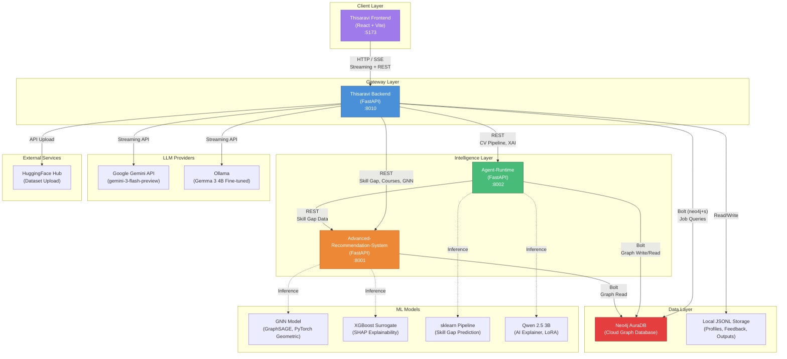

---

## 3. Thisaravi Backend Internal Architecture

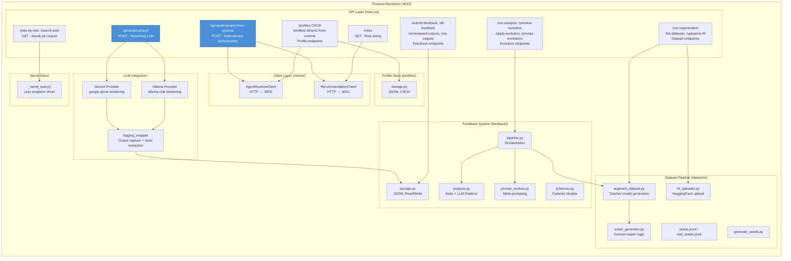

---

## 4. Request Flows

### 4.1 Manual Analysis (LLM Streaming)

This is the primary flow when a student enters their profile and a target job manually.

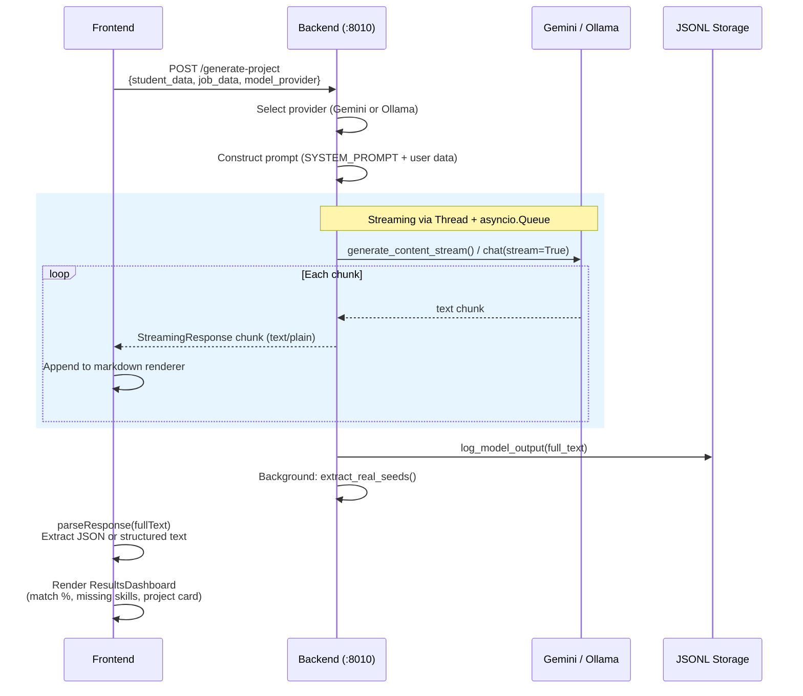

**Streaming implementation detail**: Both Gemini and Ollama use synchronous streaming APIs. The backend bridges these to async via a background `threading.Thread` that pushes chunks onto an `asyncio.Queue`. An async generator awaits the queue and yields chunks to FastAPI's `StreamingResponse`.

### 4.2 Source-Based Analysis (Multi-Service Orchestration)

This flow pulls real candidate and job data from companion services instead of manual input.

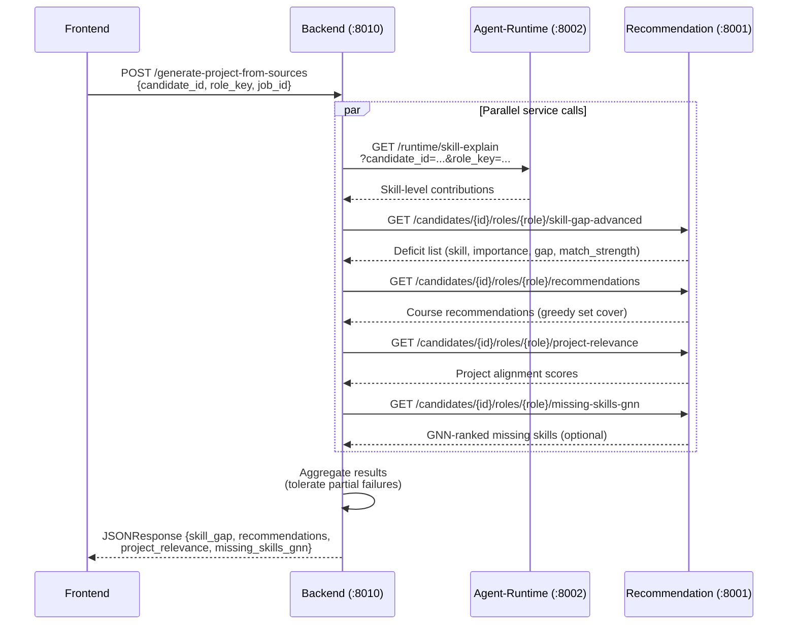

**Error tolerance**: Each downstream call is independently wrapped in try/catch. If a service fails (e.g., GNN model not loaded), the response includes an `_error` key for that section while returning successful results from other services.

### 4.3 Self-Evolution Feedback Loop

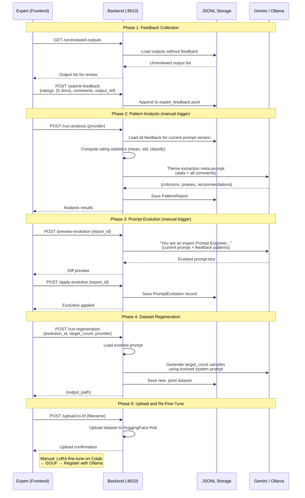

---

## 5. Downstream Service Architecture

### 5.1 Agent-Runtime Pipeline

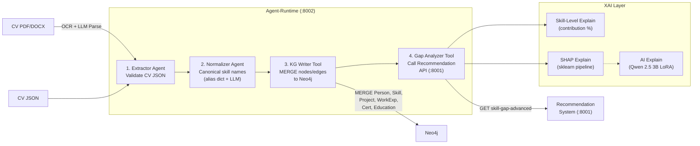

**Graph schema written by KG Writer:**

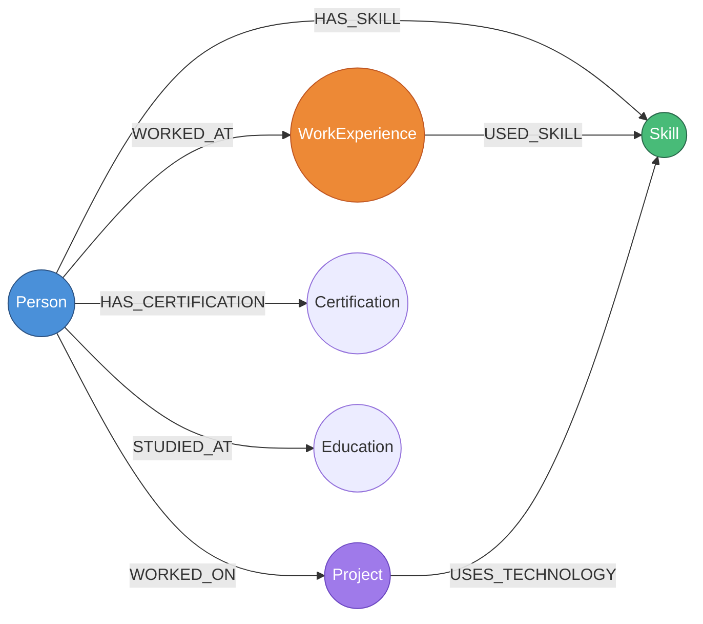

### 5.2 Advanced-Recommendation-System Computation Pipeline

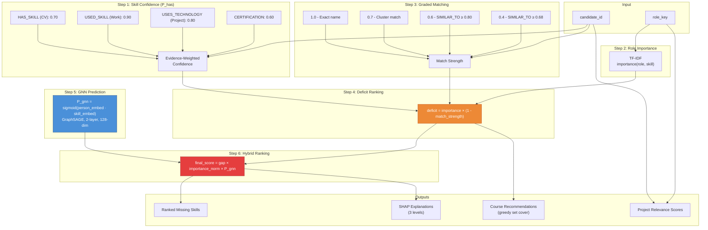

**Formula reference:**

| Formula | Description |
|---------|-------------|
| `P_has(skill) = 1 - Π(1 - w_i)` | Probability candidate has skill, across all evidence instances |
| `importance(role, skill) = TF × IDF` | How important a skill is for a role, based on job postings |
| `deficit(skill) = importance × (1 - match_strength)` | How much this skill gap matters |
| `P_gnn = σ(z_person · z_skill)` | GNN link prediction: learnability score |
| `final_score = gap × importance_norm × P_gnn` | Hybrid multiplicative ranking |
| `course_gain = Σ(deficit) + rating_boost - difficulty_penalty` | Course selection criterion |

---

## 6. Data Flow: End-to-End

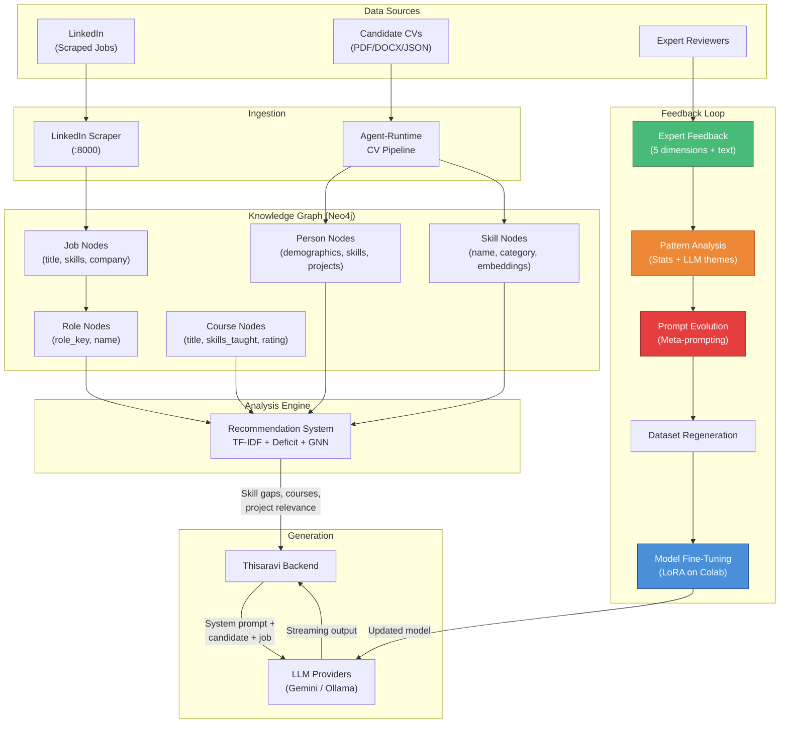

---

## 7. Technology Stack Summary

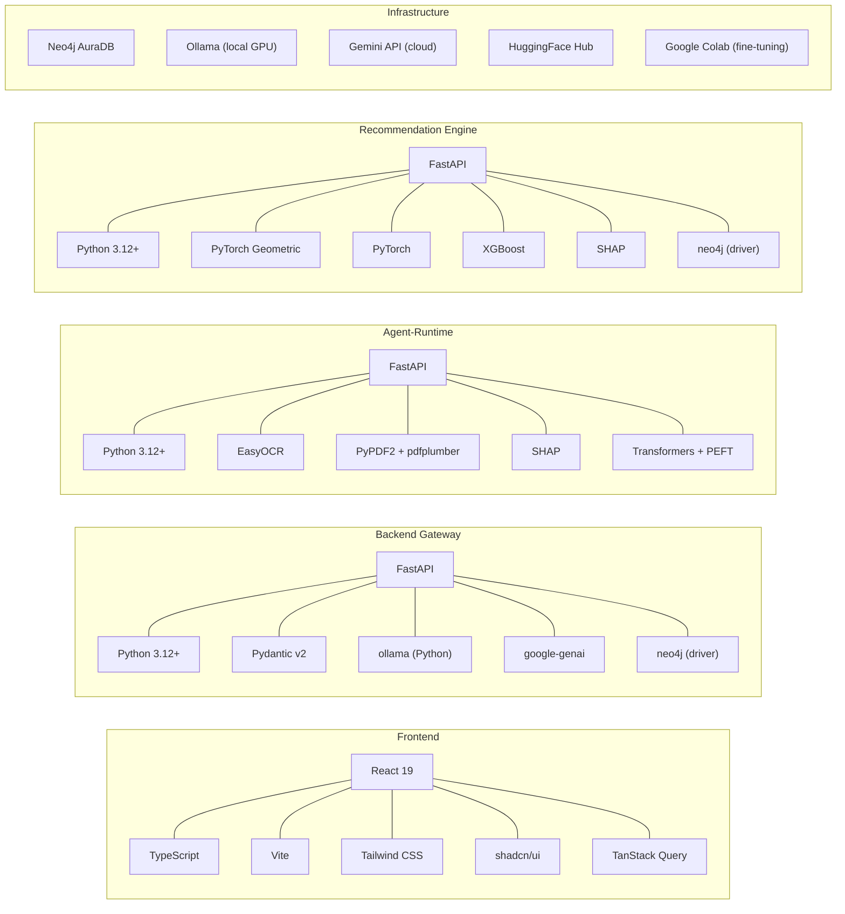

---

## 8. Communication Patterns

| From | To | Protocol | Pattern | Purpose |
|------|----|----------|---------|---------|
| Frontend | Backend | HTTP | Streaming (text/plain) | LLM generation with live rendering |
| Frontend | Backend | HTTP | REST (JSON) | Feedback, profiles, jobs, evolution |
| Backend | Agent-Runtime | HTTP | REST (JSON) | CV pipeline, XAI, profile sync |
| Backend | Recommendation | HTTP | REST (JSON) | Skill gap, courses, GNN ranking |
| Backend | Neo4j | Bolt (neo4j+s) | Cypher queries | Job search and lookup |
| Backend | Gemini | HTTPS | Streaming API | Cloud LLM generation |
| Backend | Ollama | HTTP | Streaming API | Local LLM generation |
| Backend | HuggingFace | HTTPS | REST API | Dataset upload |
| Agent-Runtime | Neo4j | Bolt | Cypher MERGE/CREATE | Graph writing |
| Agent-Runtime | Recommendation | HTTP | REST (JSON) | Gap analysis data |
| Recommendation | Neo4j | Bolt | Cypher READ | Graph traversal, TF-IDF, matching |

---

## 9. Neo4j Knowledge Graph Schema

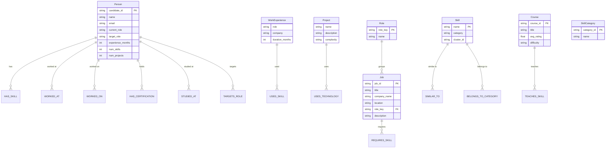

---

## 10. Deployment Topology

```
┌─────────────────────────────────────────────────────────────────┐
│  Development Machine                                             │
│                                                                  │
│   ┌──────────────┐  ┌──────────────┐  ┌──────────────────────┐  │
│   │  Frontend     │  │  Backend     │  │  Agent-Runtime       │  │
│   │  :5173        │  │  :8010       │  │  :8002               │  │
│   │  (Vite dev)   │  │  (uvicorn)   │  │  (uvicorn)           │  │
│   └──────┬───────┘  └──────┬───────┘  └──────────┬───────────┘  │
│          │                 │                      │              │
│          │   ┌─────────────┴──────────────┐       │              │
│          │   │  Recommendation System     │       │              │
│          │   │  :8001 (uvicorn)           │       │              │
│          │   └─────────────┬──────────────┘       │              │
│          │                 │                      │              │
│   ┌──────┴─────────────────┴──────────────────────┴───────────┐  │
│   │  Ollama (:11434)   │  Neo4j AuraDB (Cloud)                │  │
│   │  - Gemma 3 4B FT   │  - Candidates, Skills, Roles, Jobs  │  │
│   │  - Gemma 3 1B      │  - Courses, Projects, Categories    │  │
│   │  - Qwen 2.5 3B     │                                     │  │
│   └─────────────────────┴─────────────────────────────────────┘  │
│                                                                  │
│   External APIs: Gemini (cloud), HuggingFace Hub, Open Router   │
└─────────────────────────────────────────────────────────────────┘
```

All services currently run on a single development machine. For production deployment, the recommended split would be:

| Tier | Services | Notes |
|------|----------|-------|
| **Edge** | Frontend (static build) | CDN or Nginx |
| **Application** | Backend, Agent-Runtime | Stateless, horizontally scalable |
| **Compute** | Recommendation System, Ollama | GPU-capable node for GNN + LLM inference |
| **Data** | Neo4j AuraDB | Managed cloud service |

---

## 11. Security Considerations (Current State)

| Area | Status | Notes |
|------|--------|-------|
| Authentication | localStorage-based | No real auth; frontend stores user data in localStorage |
| Authorization | Role-based (student/expert) | Frontend-enforced only |
| CORS | Restricted to localhost origins | `localhost:5173` and `localhost:8080` |
| Input validation | Pydantic models | All request bodies validated, but no rate limiting |
| Secrets | `.env` files | Not committed to git (in `.gitignore`) |
| Inter-service auth | None | All services trust each other on localhost |
| Neo4j | Cloud with credentials | Connection string and password in environment variables |
